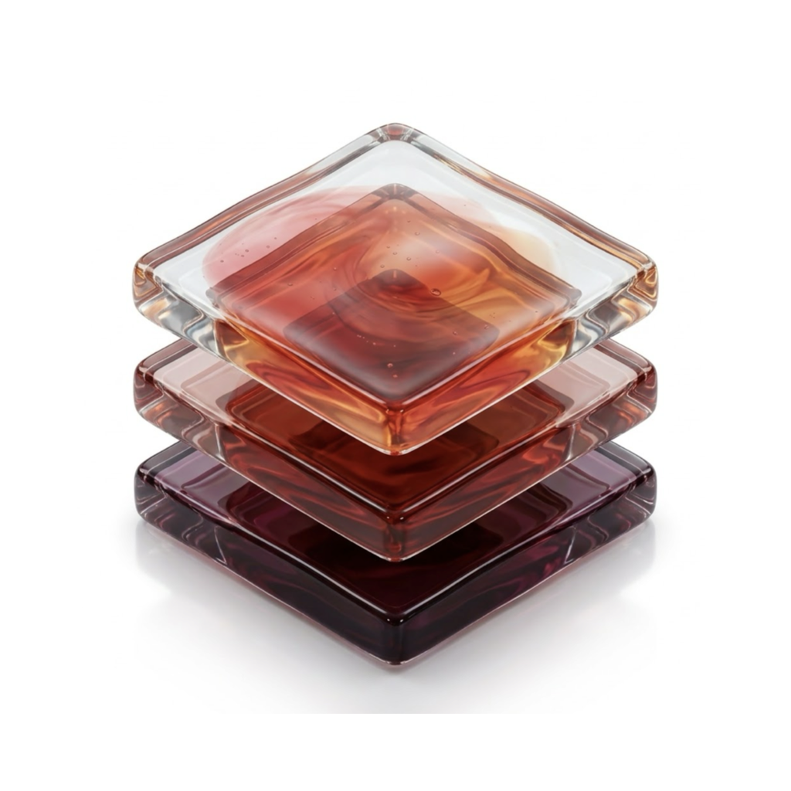
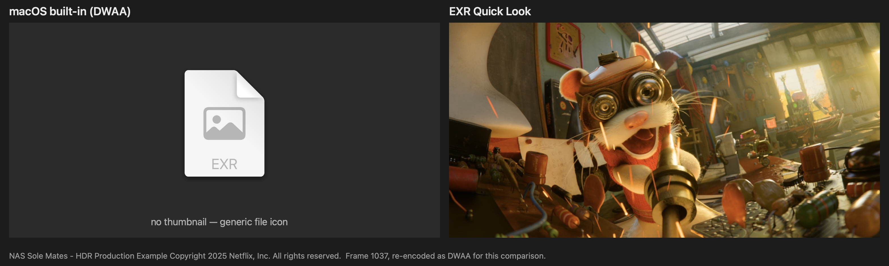
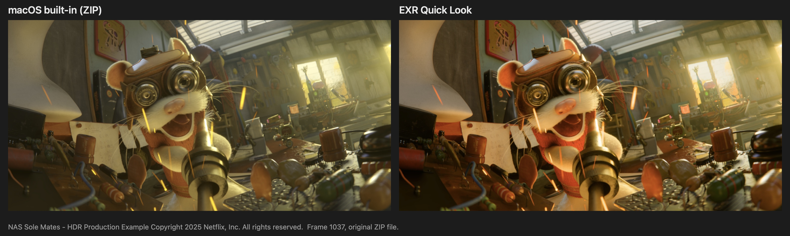
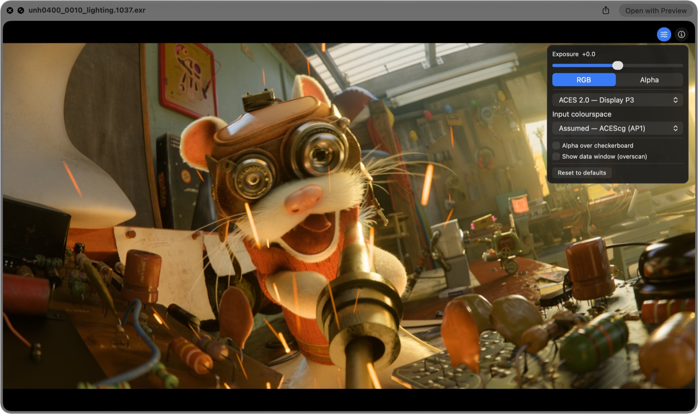

<p align="center">
  
</p>

# EXR Quick Look

[](https://github.com/bizmar/exr-quicklook/actions/workflows/ci.yml)
[](https://github.com/bizmar/exr-quicklook/actions/workflows/compat.yml)

Finder thumbnails and Quick Look previews for modern OpenEXR files on macOS:
DWAA/DWAB, multi-part and multi-layer, rendered through the ACES 2.0 output
transform.

> [!NOTE]
> **Disclaimer:** built and vibecoded with Claude Code. I use it on my own
> production files on macOS 26 and 27, and every change is tested automatically
> on macOS 14, 15 and 26, Apple silicon and Intel, but few people have tried it
> yet. [What is tested, and what isn't](docs/TESTING.md). If you try it,
> especially on a setup listed there as untested, please
> [post a test report](https://github.com/bizmar/exr-quicklook/issues/new?template=test-report.yml).
> Security bugs go through [private reporting](SECURITY.md) instead.

> [!TIP]
> **Annoyed that macOS can't read these files itself? Tell Apple.** This
> project fixes Finder and Quick Look, but only Apple can fix Preview and the
> rest of the system, and it counts reports.
> [How to file a Feedback report, with text to paste](docs/TELL-APPLE.md):
> about five minutes.

## Why

macOS's built-in EXR support has not kept up with the format. OpenEXR gained
DWAA and DWAB compression in **2014** (version 2.2), and they have since become
the standard lossy compression for comp and render output in VFX and animation.
Twelve years on, Apple's decoder still cannot read them. Finder shows a generic
icon, and the spacebar preview has nothing to show:



This project is my attempt to bring EXR viewing on the Mac up to date. It uses
the current OpenEXR reference library (3.4) and an ACES 2.0 view transform, and
it understands layers, parts, data passes and colour tags written by today's
tools.

**Why only Finder and Quick Look, not Preview?** Preview.app has no way to add
new image decoders. Apple offers no public plug-in mechanism for its image
formats, so Preview keeps using the built-in decoder. Quick Look extensions are
the one supported route, and they cover Finder thumbnails, the spacebar
preview, the column view and the preview pane.

On files macOS *can* read (ZIP, PIZ and so on), its built-in rendering on
macOS 27 is close to ours. The differences there are the tone curve, the
handling of colour primaries, and what happens with layers, alpha and
overscan:



## What it does

| | |
|---|---|
| **Compression** | Everything the OpenEXR 3.4 reference library reads: DWAA, DWAB, ZIP, PIZ, PXR24, B44, RLE, HTJ2K |
| **Colour** | ACES 2.0 output transform (SDR 100 nits, Display P3), baked from OpenColorIO's ACES 2.0 studio config. Reads `chromaticities`, the OpenEXR 3.4 `colorInteropID` and Arnold's `arnold/color_space`. Untagged files are assumed to be ACEScg; 18 other scene-linear spaces, plus PQ HDR masters (P3-D65 and Rec.2100), can be chosen in the preview. |
| **Multi-part and multi-layer** | Picks the beauty automatically, never a mask, depth or cryptomatte. Every other layer and part is a click away in the preview. |
| **Data passes** | Position, depth, motion, normals, IDs and mattes are listed as "data" and shown untransformed (Raw), with x/y/z mapped to red/green/blue. How layers are recognised: [docs/LAYER-RULES.md](docs/LAYER-RULES.md), checked against 291 real production files |
| **Overscan** | Cropped to the display window. The preview can show the data window. |
| **Alpha** | Ignored by default, so images look the way the comp sees them. The preview can composite over a checkerboard. |
| **Safety** | Hardened decode with checked arithmetic, hard size limits and a decode deadline. Malformed files get the generic icon, never a crash. |
| **Consistency** | No auto-exposure, ever. Every frame of a sequence gets the same transform, and the thumbnail and default preview are pixel-identical. |

### The preview overlay



Press Space on an EXR. Two buttons sit in the corner:

- **Display options**: exposure, RGB or alpha, layer and part, view transform
  (sRGB, Display P3, Rec.709, Raw…), input colourspace override, alpha over
  checkerboard, data window.
- **File information**: compression, colourspace, channels, layers, and data
  and display windows.

Changes carry over as you arrow through a folder. EXRs are usually image
sequences, so a misapplied colourspace gets fixed once rather than on every
frame. An orange dot on the button means something differs from the defaults.
Reset clears everything, and settings lapse after 30 minutes idle.

### For playback, pair it with a sequence player

Quick Look shows one frame at a time and never plays sequences. That's a
deliberate non-goal. For playback and review, two free, open-source (BSD-3)
players run natively on macOS, Apple silicon and Intel:

- [**DJV**](https://github.com/grizzlypeak3d/DJV): a fast, high bit-depth
  image sequence player for dailies, shot review and A/B comparison.
- [**mrv2**](https://github.com/ggarra13/mrv2): a professional player and
  review tool for VFX and animation.

## Install

> **The app is not signed or notarised.** This project has no Apple Developer
> account and won't have one, so macOS blocks it the first time. The steps
> below get past that once; after that it behaves like any other app.

1. **Download** `EXR-Quick-Look-<version>.dmg` from the
   [latest release](https://github.com/bizmar/exr-quicklook/releases/latest).
   Open it and drag **EXR Quick Look** onto the **Applications** folder in the
   window.

   **Or with [Homebrew](https://brew.sh)**, which then also delivers updates
   through `brew upgrade`:
   ```bash
   brew install --cask bizmar/tap/exr-quicklook
   ```
   It downloads the same DMG and checks its SHA-256. Steps 2 and 3 still apply
   (and step 2 again after each update).
2. **Open the app once.** Double-click it in Applications. macOS says it
   cannot check or verify the app; click **Done** or **OK** (not Move to
   Trash). Then:
   1. open **System Settings → Privacy & Security** and scroll down to
      **Security**;
   2. next to *"EXR Quick Look" was blocked*, click **Open Anyway**, and enter
      your password;
   3. click **Open Anyway** once more in the dialog that follows.

   The app's window opens. You only do this once.

   <details>
   <summary>Prefer Terminal? One command instead.</summary>

   ```bash
   xattr -dr com.apple.quarantine "/Applications/EXR Quick Look.app"
   ```
   Then double-click the app. (Right-click → **Open** no longer bypasses this
   on macOS 15 and later; Apple removed that shortcut.)
   </details>
3. **Check the extensions are on.** The app's window has a button that takes
   you there: **System Settings → General → Login Items & Extensions**.
   - Scroll down to the **Extensions** section. It can be a long way down the
     page, so keep scrolling.
   - Find the **Quick Look** row and click the **ⓘ** button at its right-hand
     end.
   - Make sure both **EXR Quick Look Preview** and **EXR Quick Look Thumbnail**
     are switched on. They may already be.
4. **Try it.** Select an EXR in Finder and press Space.

### Check the download (optional, recommended for an unsigned app)

Every release from 0.3.1 on is built by this repository's GitHub Actions, not
on anyone's laptop, and GitHub records a signed attestation of exactly which
commit and workflow produced the DMG. With the
[GitHub CLI](https://cli.github.com):

```bash
gh attestation verify EXR-Quick-Look-<version>.dmg -R bizmar/exr-quicklook
```

It should print `✓ Verification succeeded!` and name
`.github/workflows/ci.yml@refs/tags/v<version>` as the build workflow. Any
change to the file after the build makes it fail. Each release's notes also
link a [VirusTotal](https://www.virustotal.com) scan of the same DMG by about
60 antivirus engines, run by CI and attested too. A clean scan means no engine knows
anything bad about the file; it is not a guarantee, which is why the build
attestation matters more. (0.2.0 and earlier were built by hand and carry only
a SHA-256.)

### After installing

**Updates.** The app's window checks GitHub for a newer release when you open
it, and offers a link if there is one; it downloads and installs nothing
itself. That one request to `api.github.com` is the only network access in the
project: the Quick Look extensions have none. Turn it off in the window. To
hear about releases without opening the app, use **Watch → Custom → Releases**
on this repository.

**Thumbnails already in Finder may not change straight away.** macOS caches
them. Open a folder you haven't viewed since installing, or log out and back
in.

**Still a generic icon?** Check both switches in step 3 are on. A few kinds of
file deliberately keep the generic icon (deep images, luminance-chroma); see
[Limitations](#limitations).

**Uninstall:** drag **EXR Quick Look** from Applications to the Trash (or
`brew uninstall --cask exr-quicklook`). The extensions live inside the app and
go with it; there is nothing to switch off first. The only other traces are
the small settings folders macOS keeps for sandboxed apps:
`~/Library/Containers/io.github.bizmar.exr-quicklook*` and
`~/Library/Group Containers/group.io.github.bizmar.exr-quicklook`. To remove
them, drag them to the Trash in Finder (Shift-Cmd-G to go there). macOS
protects them from Terminal, so `rm` and `mv` there fail unless Terminal has
Full Disk Access.

Tested by hand on macOS 26 and 27 (Apple silicon). Every push is also tested
on GitHub's Macs: **macOS 14, 15 and 26 on Apple silicon, and macOS 15 on
Intel**, where Quick Look itself renders thumbnails and previews through the
extensions and the output matches the reference images.

## Limitations

- **No preferences window.** Unsigned extensions can't read shared settings,
  so the assumed input colourspace (ACEScg) and the default view (P3) are fixed.
  Everything adjustable lives in the preview overlay. A fork with a Developer
  ID can turn the preference plumbing back on.
- **Untagged files are assumed to be ACEScg.** Many real files carry no colour
  tag. Nuke, for example, writes none unless "write ACES compliant EXR" is
  ticked, and Blender's linear Rec.709 output will look oversaturated under
  that assumption. Correct it in the overlay; the correction carries across the
  sequence.
- **SDR only.** No HDR / EDR output yet.
- **Not rendered:** deep images, luminance-chroma (`Y`/`RY`/`BY`) files, and
  cryptomatte-only files without a preview layer. These keep the generic icon
  rather than showing something approximate.
- **Untested:** Spotlight, Open and Save dialogs, Intel Macs by hand (CI only),
  and real multi-layer renders from most applications. The full list is in
  [docs/TESTING.md](docs/TESTING.md).

## Build from source

Needs only the Xcode Command Line Tools (no Xcode, no `.xcodeproj`), plus CMake.
Python with PyOpenColorIO is only needed to re-bake the colour tables.

```bash
Tools/build-openexr.sh   # pinned OpenEXR + Imath, universal static (once)
Tools/build-core.sh      # EXRCore
Tools/build-app.sh     # build/EXR Quick Look.app, universal, ad-hoc signed
Tools/install.sh   # install to ~/Applications and register
Tools/test-all.sh        # every test suite
```

The baked ACES tables are committed, with their hashes and tool versions in
[`docs/lut-provenance.md`](docs/lut-provenance.md). Design notes and findings
are in [`docs/`](docs/), including how a third-party extension can take over
`com.ilm.openexr-image` from Apple's own handler
([`docs/uti-findings.md`](docs/uti-findings.md)).

## Credits and licence

BSD-3-Clause, see [`LICENSE`](LICENSE). Bundled libraries (OpenEXR, Imath,
OpenJPH, libdeflate) and their licences are listed in
[`THIRD_PARTY_NOTICES.md`](THIRD_PARTY_NOTICES.md). ACES tables are generated
with [OpenColorIO](https://opencolorio.org).

Comparison and preview images: NAS Sole Mates - HDR Production Example Copyright 2025
Netflix, Inc. All rights reserved. Used under the ASWF Digital Assets License
v1.1; details and how the images differ from the original are in
[`docs/images/CREDITS.md`](docs/images/CREDITS.md).

The app icon was generated with Google Gemini, inspired by the
[OpenEXR project artwork](https://artwork.aswf.io/projects/openexr/). No
copyright is claimed on it.

ACES is a trademark of the Academy of Motion Picture Arts and Sciences. This
project is not affiliated with or endorsed by the Academy, the Academy
Software Foundation, the OpenEXR project, or Netflix.
