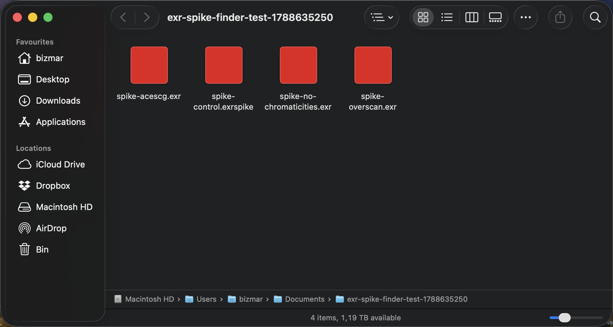

# Can a third-party Quick Look extension claim `com.ilm.openexr-image`?

**Answer: yes. Both the thumbnail and the preview extension are invoked for
`.exr` files, overriding Apple's built-in rendering.**

Per the Phase 0 decision gate in [the plan](exr-quicklook-plan.md) §4, this is
the "Both work → proceed as planned" outcome.

| | Date | OS | Build | Hardware |
|---|---|---|---|---|
| Tested | 2026-09-05 | macOS 26.6.2 | 25G83 | Apple M2 Pro (arm64) |

Toolchain: Command Line Tools 26.6.0 only — **full Xcode was not installed**.
SDK 26.5, Swift 6.3.3. The spike is built and signed entirely from the command
line (see [Reproducing](#reproducing)).

---

## 1. Why this needed testing

`com.ilm.openexr-image` is a **system-supported UTI**: declared by macOS itself,
bound to `.exr`, and served by Apple's own closed decoder (`libAppleEXR.dylib`)
through ImageIO. The concern recorded in the plan was that:

- Apple DTS has stated system-wide default UTIs take priority over third-party
  declarations, with no supported override.
- iOS App Store validation actively rejects `QLSupportedContentTypes` arrays
  containing system-supported types.
- Anecdotally, thumbnail extensions might be honoured where preview extensions
  are not.

If any of that applied to macOS, the entire product shape would have had to
change. It does not.

Confirmed on the test machine before building anything:

```
com.ilm.openexr-image: declared=true dynamic=false  desc="OpenEXR image"  ext=["exr"]
.exr resolves to: com.ilm.openexr-image
All types claiming .exr: com.ilm.openexr-image   (only one)
```

## 2. What was built

The minimum from §4, plus one addition:

| Target | Kind | Behaviour |
|---|---|---|
| `EXRPreview.app` | SwiftUI host app | Does nothing but contain the extensions |
| `EXRThumbnail.appex` | `QLThumbnailProvider` | Fills the reply with solid **red** |
| `EXRQuickLook.appex` | `QLPreviewingController` | Solid **blue** view + filename |

Both extensions declare **two** content types:

```xml
<key>QLSupportedContentTypes</key>
<array>
    <string>com.ilm.openexr-image</string>   <!-- the system UTI under test -->
    <string>com.exrquicklook.spike-image</string>  <!-- positive control -->
</array>
```

### The positive control matters

`com.exrquicklook.spike-image` is a custom type exported by the host app, bound
to the extension `.exrspike`. The control fixture
`spike-control.exrspike` is a **byte-for-byte copy** of `spike-acescg.exr`.

The only difference between the two files is the filename extension, and
therefore the UTI. That isolates one variable: without the control, a negative
result could not distinguish "the system UTI blocked us" from "our
hand-assembled bundle failed to register at all".

LaunchServices types them apart correctly, so the control is valid:

```
spike-acescg.exr          UTI: com.ilm.openexr-image
spike-control.exrspike    UTI: com.exrquicklook.spike-image
```

(Note that **ImageIO** does not agree — `CGImageSourceGetType` reports
`com.ilm.openexr-image` for the `.exrspike` file, because ImageIO sniffs
content. Quick Look dispatch follows LaunchServices, which types by extension.)

## 3. Results

Against the §4 checklist:

| Question | Result |
|---|---|
| Thumbnail extension invoked for `.exr` in Finder icon view? | **Yes** |
| Preview extension invoked on spacebar? | **Yes** |
| Survives `qlmanage -r`? | **Yes** |
| Survives reboot? | **Yes** — verified 2026-09-05, 3 min after boot, no reinstall |
| Finder icon view | **Yes** (thumbnail) |
| Finder preview pane (list view + ⌘⇧P) | **Yes** (preview) |
| Finder column view | **Thumbnail only** — column view renders a large icon, not a QL preview. Expected, not a limitation. |
| Spotlight, Open/Save dialogs | **Not yet tested** — see §6 |
| Real-world (not synthetic) EXR files | **Yes** — verified on a 32 MB `rawtoaces` output and an unrelated 900 KB file |

### Evidence

Finder icon view, four fixtures, all rendered by our extension:



Unified log, thumbnail extension invoked for a `com.ilm.openexr-image` file:

```
EXRThumbnail[87090] [com.exrquicklook.spike:thumbnail] SPIKE-THUMB invoked
    file=.../spike-acescg.exr max=64.000000x64.000000 scale=2.000000
```

Unified log, preview extension invoked from the Finder spacebar panel:

```
EXRQuickLook[87152] [com.exrquicklook.spike:preview] SPIKE-PREVIEW invoked
    file=.../spike-acescg.exr
```

Programmatic check through `QLThumbnailGenerator` — the same API Finder uses —
comparing the system UTI against the control:

```
spike-acescg.exr        512pt  thumbnail  1024x1024  rgb(0.90, 0.10, 0.10) cov=100%  OUR EXTENSION
spike-control.exrspike  512pt  thumbnail  1024x1024  rgb(0.90, 0.10, 0.10) cov=100%  OUR EXTENSION
```

`rgb(0.90, 0.10, 0.10)` is exactly the colour the spike paints.

### Restart survival

Verified after a real reboot, with no reinstall and no re-registration:

```
uptime: up 3 mins
  PASS  both extensions still registered with PluginKit
  PASS  both extensions still enabled (found 2 with '+')
  PASS  thumbnail extension invoked for com.ilm.openexr-image
  PASS  preview extension invoked for com.ilm.openexr-image
  4 passed, 0 failed
```

Both extensions also appear in **System Settings → General → Login Items &
Extensions**, listed under the host app as "EXRPreview — Quick Look, Quick
Look", so the registration is visible to the user and not just to `pluginkit`.

## 4. Methodology warning: the thumbnail cache nearly produced a false negative

**This is the most important practical finding in this document.**

The first run of the probe reported that `.exr` files were still being rendered
by Apple and only the `.exrspike` control got our red — i.e. exactly the
"system UTI wins" result the plan feared. That conclusion was wrong.

Quick Look had cached thumbnails for those files from **before** the extension
was installed, and served the stale entries. After `qlmanage -r cache` and
killing the extension host processes, the same files rendered red.

Practical consequences:

- Any Phase 0-style test **must** reset the cache, or use a directory the
  Finder has never displayed, before drawing conclusions. `Tools/spike-finder-test.sh`
  creates a fresh timestamped folder for exactly this reason.
- A stale cache is indistinguishable from a non-invoked extension by looking at
  Finder. Only the unified log distinguishes them. Trust the log.
- This is the same caveat the plan already flags for shipping (§5: thumbnail
  changes often don't appear until a folder is opened fresh or the user logs
  out). It bites during development too, and much harder.

Reset incantation used throughout:

```bash
qlmanage -r cache; qlmanage -r; killall -9 EXRThumbnail EXRQuickLook quicklookd
```

## 5. Secondary findings

### 5.1 `pluginkit -p com.apple.quicklook.thumbnail` is broken on macOS 26.6.2

The plan's §8 debugging advice does not work as written. On this OS:

```
pluginkit -mAv                                    → 491 extensions
pluginkit -mAv -p com.apple.quicklook.preview     →  21 extensions
pluginkit -mAv -p com.apple.quicklook.thumbnail   →   0  ("no matches")
```

Zero is wrong: at least 11 thumbnail extensions are registered, Apple's own
among them. Filter on the `SDK` field of the verbose listing instead:

```bash
pluginkit -mAvvv | awk 'NF<=2 && $NF ~ /\(.*\)$/ {id=$NF}
                        /SDK = com.apple.quicklook.thumbnail/ {print id}'
```

`Tools/spike-status.sh` uses this form.

### 5.2 The disable flag is honoured for preview but not for thumbnail

With both extensions explicitly disabled (`pluginkit -e ignore`, listing shows
`-`), cache reset, and hosts killed:

| Extension | Invoked while disabled? |
|---|---|
| `EXRQuickLook` (preview) | No — correctly suppressed |
| `EXRThumbnail` (thumbnail) | **Yes — still invoked** |

Re-enabling restored the preview extension, so the mechanism works; the
asymmetry is reproducible. Whether the System Settings toggle behaves the same
as `pluginkit -e ignore` has not been verified — that is worth checking before
documenting any "turn it off" instructions for users.

### 5.3 The thumbnail drawing context is not pre-scaled

`QLThumbnailReply(contextSize:drawing:)` hands back a `CGContext` sized in
**pixels**, while `request.maximumSize` is in **points**. Filling
`CGRect(origin: .zero, size: request.maximumSize)` covers only 1/scale² of the
reply — 25% on a 2× display, with the remainder transparent.

Fill `ctx.boundingBoxOfClipPath` instead. This cost an hour of confusion here
and is a live trap for Phase 3.

### 5.4 Baseline: what Apple's decoder currently does with these files

Measured with `CGImageSource` directly, bypassing Quick Look. Relevant to
Phase 1, not to the Phase 0 question:

| Fixture | Chromaticities in file | Colour space Apple assigns | Dimensions returned |
|---|---|---|---|
| `spike-acescg.exr` | ACEScg / AP1 present | **none (`nil`)** | 640×360 (display window) |
| `spike-no-chromaticities.exr` | absent | `kCGColorSpaceExtendedLinearSRGB` | 640×360 |
| `spike-overscan.exr` | ACEScg / AP1 present | none (`nil`) | **704×424 (data window)** |

Two things worth carrying forward:

- The behaviour is **inverted**. The file that declares its primaries gets no
  colour space at all; the file that declares nothing gets assumed linear sRGB.
  That is a decent one-line summary of why this project exists.
- Apple returns the **data window**, not the display window. Overscan shifts
  framing. Confirms decision D6 is necessary, with a reproducible case.

### 5.6 Full Xcode is not required for this project

Audited because the dev machine has Command Line Tools only. Checked what each
phase actually needs rather than assuming:

| Tool | Needed for | Available under CLT 26.6.0? |
|---|---|---|
| `clang++`, `libtool`, `ar`, `lipo` | Building OpenEXR static | Yes |
| `cmake` 4.3.2 | Building OpenEXR (§6.1) | Yes (Homebrew) |
| `swiftc` 6.3.3 | Everything Swift | Yes |
| `swift test` | Unit tests (§9) | Yes |
| `codesign` | Signing (§10) | Yes |
| `notarytool` 1.1.2 | Notarising the DMG (§10) | **Yes** — ships with CLT |
| `stapler` | Stapling the ticket | Yes |
| `iconutil` | Building the app icon `.icns` | Yes |
| `actool` | Asset catalogs | **No — Xcode only** |
| `ibtool` | Storyboards and XIBs | **No — Xcode only** |
| `xcodebuild` | `.xcodeproj` builds | **No — Xcode only** |

The two missing tools are avoidable, and cost nothing:

- **`actool`** — ship the app icon as a plain `.icns` referenced by
  `CFBundleIconFile` rather than an asset catalog. `iconutil` builds the
  `.icns` and is present.
- **`ibtool`** — build the preview view controller's view in code. The spike
  already does this via `NSExtensionPrincipalClass`; no storyboard is involved,
  and §8's overlay HUD does not need one either.

The Phase 1 mechanism was verified end to end rather than assumed: a CMake
project with `CMAKE_OSX_ARCHITECTURES="arm64;x86_64"` producing a C++17 static
library using exceptions and RTTI, linked into a universal Swift binary through
a module map, compiles and runs under CLT alone.

**Conclusion: do not install Xcode.** The one thing genuinely blocking §10 is
unrelated to it — `security find-identity -v -p codesigning` reports **0 valid
identities**, so there is no Developer ID certificate on this machine. Signing
and notarising a public release needs an Apple Developer Program membership,
which is a separate decision from installing an IDE.

### 5.6 A Quick Look extension can be built without Xcode

Everything in this spike was built with **Command Line Tools only**. Full Xcode
was never installed. Audited against the rest of the plan, the CLT toolchain
covers every phase:

| Need | Tool | CLT? |
|---|---|---|
| Compile Swift + link appex | `swiftc`, `-e _NSExtensionMain` | yes |
| Universal binaries | `lipo`, `-target <arch>-apple-macos14.0` | yes |
| Build OpenEXR/Imath static (Phase 1) | `cmake` + `clang++` | yes — verified |
| Sign locally | `codesign -s -` | yes |
| Notarise + staple (Phase 5) | `notarytool` 1.1.2, `stapler` | **yes** |
| App icon | `iconutil` → `.icns` + `CFBundleIconFile` | yes |
| Unit tests (Phase 4) | `swift test` | yes |
| Asset catalogs | `actool` | **no — Xcode only** |
| Storyboards / xibs | `ibtool` | **no — Xcode only** |

The two gaps are both avoidable and were avoided here anyway: ship a plain
`.icns` rather than an asset catalog, and build the preview view in code with
`NSExtensionPrincipalClass` rather than `NSExtensionMainStoryboard`.

`notarytool` shipping in CLT is the load-bearing one — it means the whole
Phase 5 release path is reachable without a 15 GB Xcode install.

The C++-to-Swift path was verified end to end rather than assumed: a CMake
`STATIC` library built C++17 with exceptions and RTTI at
`CMAKE_OSX_ARCHITECTURES="arm64;x86_64"`, linked into a universal Swift
executable via a module map, and run. That is the exact mechanism Phase 1 needs
for OpenEXR.

**Separately**: `security find-identity -v -p codesigning` reports **0 valid
identities** on this machine. Release signing and notarisation need an Apple
Developer Program membership and a Developer ID certificate. That is a Phase 5
blocker, and it is independent of whether Xcode is installed.

### 5.5 Prior art on the machine

Two third-party Quick Look extensions were already installed. Neither is a
precedent for overriding a *system image* type, but ARRI does claim a
system-declared UTI:

| App | Types claimed | System-declared? |
|---|---|---|
| ARRI Reference Tool | `com.arri.ari`, `com.codex.arx`, `org.smpte.mxf` | `org.smpte.mxf` and `com.arri.ari`: yes |
| Pixelmator Pro | own `com.pixelmatorteam.*` types, `com.apple.videoapps.cube` | `com.apple.videoapps.cube`: yes |

### 5.7 Distribution without notarisation: registers, but does not run

Tested by simulating a download: the quarantine attribute a browser sets
(`com.apple.quarantine`, flags `0081`) applied recursively to an ad-hoc signed
copy in `~/Applications`, then registered normally.

| State | PluginKit | Extension executes? |
|---|---|---|
| Ad-hoc signed, **quarantined** | registers, listed `+` enabled | **No** — `QLThumbnailErrorDomain error 0` |
| Same bundle, quarantine removed | registers, listed `+` enabled | Yes — renders normally |

The failure mode is nasty: the extension **registers successfully and appears
enabled**, in `pluginkit` and presumably in System Settings, while silently
refusing to run. A user would see the extension listed as installed and active,
and no thumbnails, with nothing to indicate why.

Removing the attribute (`xattr -dr com.apple.quarantine`) restores it
immediately, which isolates quarantine as the sole cause — not the ad-hoc
signature itself, and not the missing Team ID.

Gatekeeper's own verdict on the ad-hoc bundle:

```
spctl -a -vvv EXRPreview.app             → rejected
spctl -a -vvv -t install EXRPreview.app  → rejected
codesign -dvvv                           → Signature=adhoc, TeamIdentifier=not set
```

**Notarisation cannot be obtained for free.** `notarytool` accepts only an App
Store Connect API key (`--key-id` + `--issuer`) or `--apple-id` with
`--team-id`. Both require a paid Apple Developer Program membership; a free
Apple ID issues "Apple Development" certificates, which are for local running,
not distribution. There is no free notarisation path.

### What actually gates execution

Gatekeeper's *assessment* and the *execution gate* are not the same thing. The
identical ad-hoc bundle is `rejected` by `spctl` in every case below; only the
quarantine attribute changes the outcome:

| Delivery path | Quarantine on extracted app | Extension runs? | Host app launches? |
|---|---|---|---|
| `.zip`, opened by Archive Utility / `ditto -x -k` | **yes** (`0281`) | **No** | prompts |
| `.tar.gz`, extracted with `tar -xzf` | **no** | **Yes** | **yes, no prompt** |
| Any bundle after `xattr -dr com.apple.quarantine` | no | Yes | yes |

`tar` does not propagate the archive's quarantine attribute to extracted files;
Archive Utility and `ditto` do. Verified end to end: a `.tar.gz` built from the
ad-hoc signed app, quarantined as a browser would, extracted with `tar`,
installed and registered — both extensions run, and the host app launches with
no Gatekeeper prompt.

**So an unnotarised release is viable without asking users to disable anything**,
provided it ships as a `.tar.gz` extracted from Terminal rather than a `.zip` or
a `.dmg`. That is a meaningfully better story than "here is how to bypass
Gatekeeper": there is nothing to bypass, because nothing ever gets quarantined.

The trade-off is that it rules out the friendly drag-to-Applications `.dmg`,
which is the one format that unavoidably carries quarantine through to the
installed app.

### "Open Anyway" does un-gate the nested extensions

Tested directly. A quarantined ad-hoc bundle (`0081`, the flag a browser sets)
registers and shows enabled but will not execute. After approving the **host
app** — either via System Settings → Privacy & Security → "Open Anyway", or by
Gatekeeper already knowing the bundle's cdhash — the quarantine flags flip from
`0081` to `00c1` (bit `0x40` = user-approved) on the app **and on both nested
`.appex` bundles**, and both extensions run:

```
app   flags: 00c1;...    thumb flags: 00c1;...    prev flags: 00c1;...
  → SPIKE-THUMB x2, SPIKE-PREVIEW x1
```

The attribute is not removed; it is re-flagged as approved, and that approval
propagates down the bundle. So a single user-facing "Open Anyway" is sufficient
for the whole extension set — no per-extension approval, and no `xattr` surgery
required.

Both documented install paths therefore work:

| README instruction | User effort | Verified |
|---|---|---|
| `.tar.gz` + `tar -xzf` in Terminal | one command, no prompt at all | yes |
| `.dmg`/`.zip` + "Open Anyway" once | one GUI approval | yes |
| `xattr -dr com.apple.quarantine <app>` | one command | yes |

### Notarisation cannot be obtained for free

`notarytool` accepts only an App Store Connect API key (`--key-id` + `--issuer`)
or `--apple-id` with `--team-id`. The [Notary REST API][notary] is not an
alternative route: it removes the *macOS* dependency, not the account
requirement — Apple's own documentation says it is for software "you distribute
with Developer ID" and instructs you to authenticate with "the same key … that
you use for the App Store Connect API". Both require a paid Apple Developer
Program membership. There is no browser upload form and no free tier.

[notary]: https://developer.apple.com/documentation/notaryapi/submitting-software-for-notarization-over-the-web

Consequences for Phase 5:

- Notarised `.dmg` needs the $99/yr membership. It buys a double-clickable
  install and no Terminal step.
- Unnotarised `.tar.gz` is free, verified working, and costs the user one
  `tar -xzf` in Terminal.
- **Untested**: whether a Homebrew cask installed with `--no-quarantine`
  sidesteps this cleanly.

## 6. Not tested

Stated plainly so nobody assumes more than was measured:

- **Logout specifically.** A full reboot was tested and passed 4/4
  (`Tools/post-restart-check.sh`, §3). A bare logout/login was not tested
  separately, on the assumption that a reboot is the stronger case.
- **Spotlight results and Open/Save dialogs.** Both use Quick Look, neither was
  exercised.
- **Any machine other than this one**, and any OS other than 26.6.2. The
  deployment target is 14.0; nothing here says how 14.x or 15.x behave.
- **A genuinely notarised install.** The *unnotarised* quarantined path was
  tested and fails (§5.7). No Developer ID certificate exists on this machine,
  so the notarised path remains untested.
- **App Store distribution.** Not a goal, and given the documented iOS
  validation behaviour, likely a problem. Direct distribution only.
- **Contention with another extension** claiming the same UTI. Untested: it is
  unknown how macOS breaks a tie between two third-party claimants.

## 7. Reproducing

```bash
Tools/make-spike-fixtures.py     # generate .exr fixtures + the control file
Tools/build-spike.sh             # build universal, ad-hoc sign
Tools/install-spike.sh           # copy to ~/Applications, register
Tools/spike-status.sh            # confirm both extensions registered
```

Enable both in **System Settings → General → Login Items & Extensions → Quick
Look**, then:

```bash
Tools/spike-finder-test.sh       # fresh uncached folder, opens in Finder
Tools/watch-spike-log.sh         # in a second terminal: live invocation log
```

Expected: four solid red thumbnails; spacebar gives a solid blue panel.

Headless verification, no Finder needed:

```bash
build/qlprobe Tests/Fixtures/spike/*        # classifies thumbnails by colour
build/qlpreviewprobe Tests/Fixtures/spike/* # drives a real QLPreviewView
build/utitool Tests/Fixtures/spike/*        # shows LaunchServices UTI assignment
```

Remove everything:

```bash
Tools/uninstall-spike.sh
```

## 8. Conclusion

The premise that blocked Phase 0 does not hold on macOS 26.6.2. A third-party
app extension can claim `com.ilm.openexr-image` and takes priority over Apple's
built-in EXR rendering, for both thumbnails and previews, in Finder and through
the public Quick Look APIs.

No change to the product shape is required. Phase 1 can proceed as planned.

The one caveat worth repeating: **the thumbnail cache lies.** Verify against the
unified log, not against what Finder happens to be showing.
